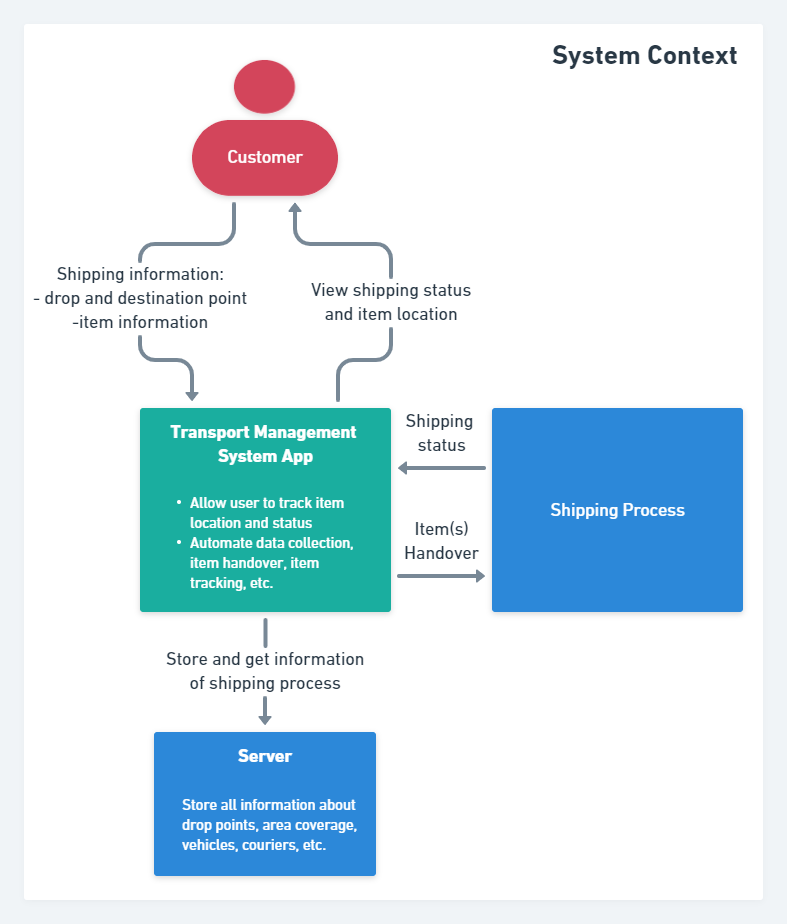
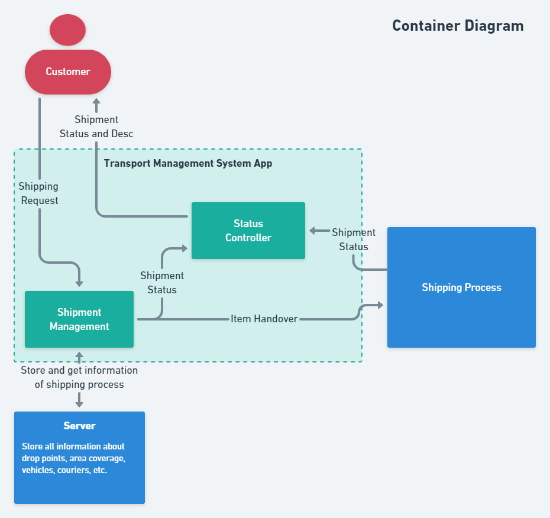
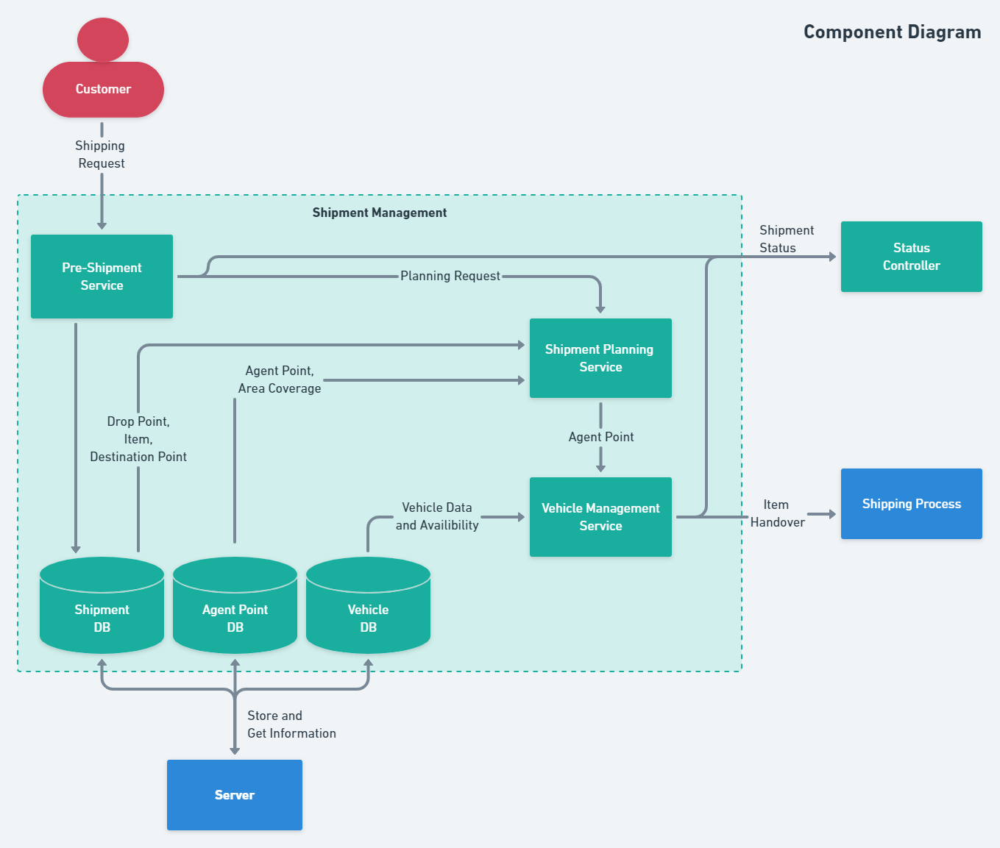
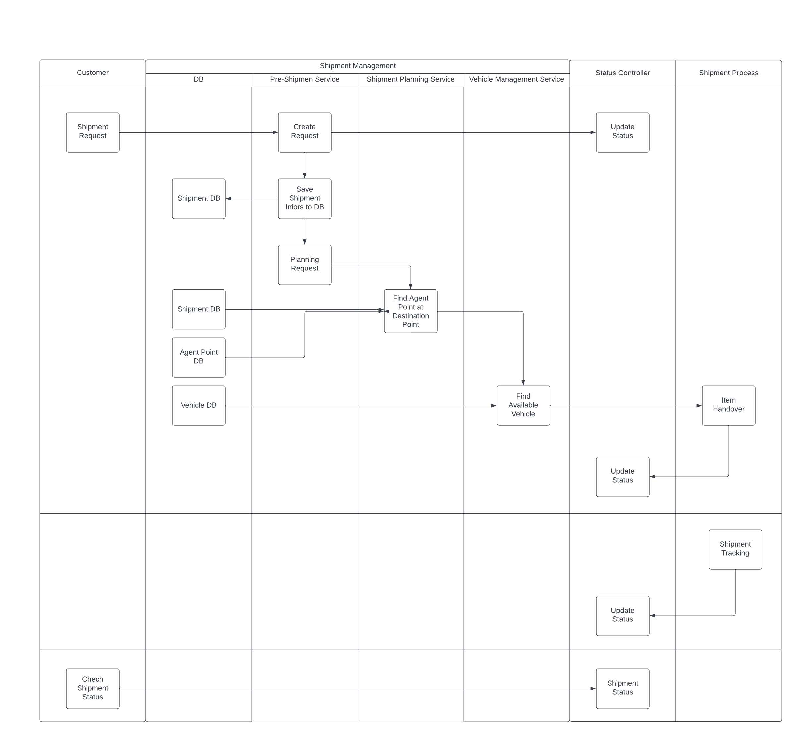
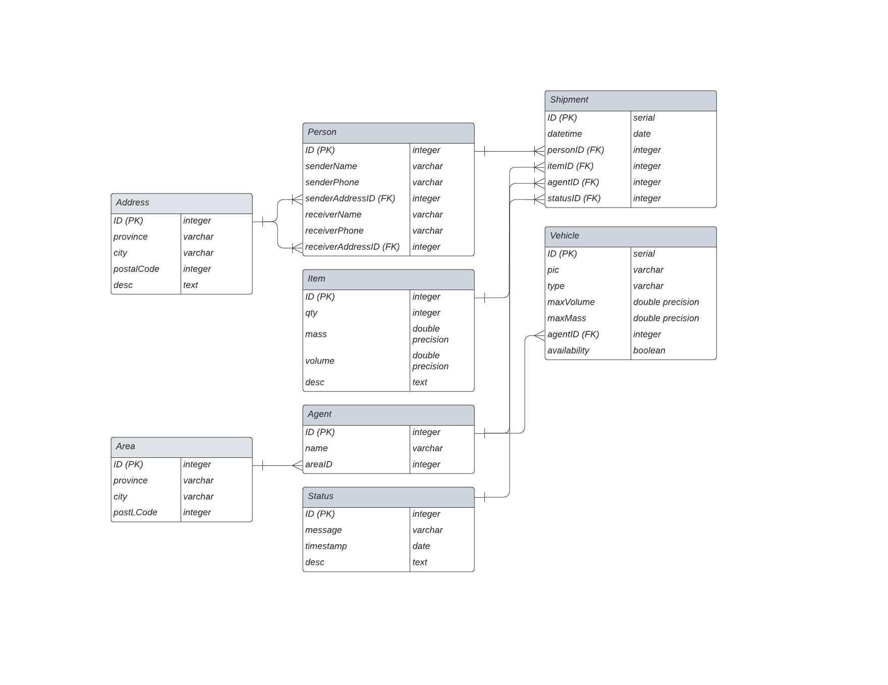

# [RFC] - Transport Management System App
## Related Document

| Document Name  | Document URL |
| --- | --- |
|  |  |

## Table of Content
Version:
<br/>
1. [Summary](#Summary)
2. [Problem and Motivation](#Problem_and_Motivation)
3. [Detailed Design](#Detailed_Design)
4. [Dependencies](#Dependencies)
5. [Milestones/Deployment Strategy](#Milestones/Deployment_Strategy)
6. [Data Result](#Data_Result)
7. [Drawbacks/Risks/Possible Failures](#Drawbacks/Risks/Possible_Failures)
8. [Alternatives](#Alternatives)
9. [Unresolved/Future Possibilities](#Unresolved/Future_Possibilities)

<br/>

***Need Review***
| @Mention Person | Status or Description |
| --- | --- |
|  |  |
<br/>

**Version**
| Date Updated | Changes Summary |
| --- | --- |
| 11 Nov 2022 | V 1.0 |
<br/>

## Summary
Transport Management System App is an application used to automate shipping process in order to maximize the utilization of vehicle’s cargo volume and find the optimal and efficient route so that reduce transport cost and improve the observability of the moving items until arrived to the desired destination point.

The current shipping process is performed manually i.e. item’s data collection, item sorting based on destination point, courier and vehicle handover, tracking item status and finding the efficient shipping route, etc. Those stuffs are heavy duty tasks when performed manually, difficult to observe and track item location and status, and prone to the risk of human error.

## Problem and Motivation
The current shipping process is performed manually i.e. item’s data collection, item sorting based on destination point, courier and vehicle handover, tracking item status and finding the efficient shipping route, etc. Those stuffs are heavy duty tasks when performed manually, difficult to observe and track item location and status, and prone to the risk of human error. 

## Detailed Design

### System Architecture

#### System Context


#### Container Diagram


#### Component Diagram


### Swimlane Diagram

### API Contract
**General**
- Success Response Format

```
{
    code: integer,
    msg: string,
    data: interface{}
}

# Example
{
    code: 200,
    msg: "successfully get user",
    data: {
        id: 1,
        ...
    },
    ...
}
```

- Error Response Format
```
{
    code: integer,
    msg: string,
    data: interface{}
}

# Example
{
    code: 404,
    msg: "invalid req body",
    data: nil
}
```
**Specific**
- Get List Requested
```
Method: "GET",
URL: "/api/v1/shipments",
Params: {},
Response Success on Data Format: 
{
    code: 200,
    msg: "successfully get user",
    data: {
        # all shipment list of joined tables
        ...
    },
    ...
}

```
- Get List ID
```
Method: "GET",
URL: "/api/v1/shipments/:id",
Params: {
    id : # specified id,
},

Response Success on Data Format: 
{
    code: 200,
    msg: "successfully get user",
    data: {
        # shipment list of joined tables at specified id
        ...
    },
    ...
}
```
- Submit Request
```
Method: "POST",
URL: "/api/v1/shipments/:id",
Body: {
    # all field in shipment request form
}
```
- Update Request
```
Method: "PUT",
URL: "/api/v1/shipments/:id",
Body: {
    # all field in shipment request form
}
```
- Delete Request
```
Method: "DELETE",
URL: "/api/v1/shipments/:id",
Body: {}
```
## Dependencies
## Milestones/Deployment Strategy
## Data Result
### ERD

## Drawbacks/Risks/Possible Failures
## Alternatives
## Unresolved/Future Possibilities
- Add efficiency analysis service to calculate the most efficient routes and vehicle management