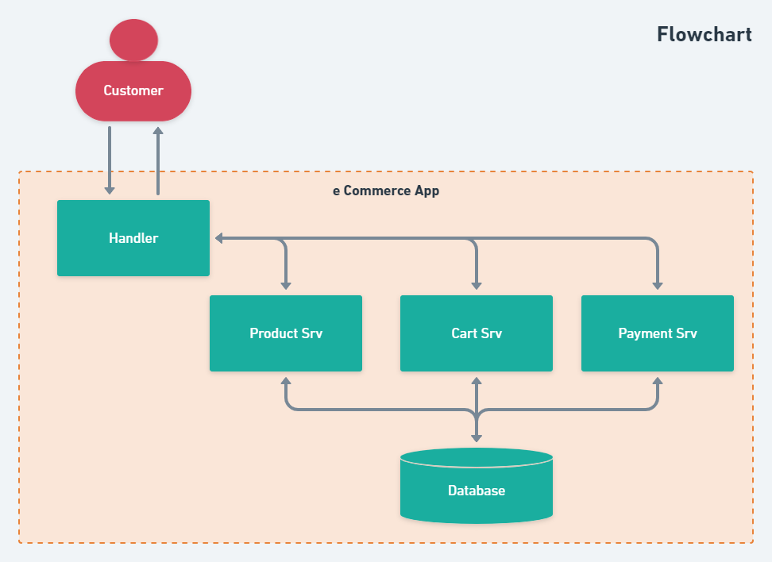
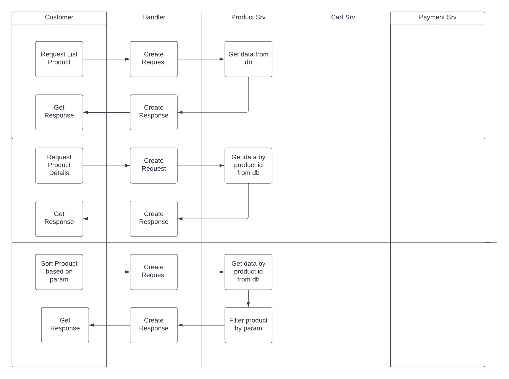
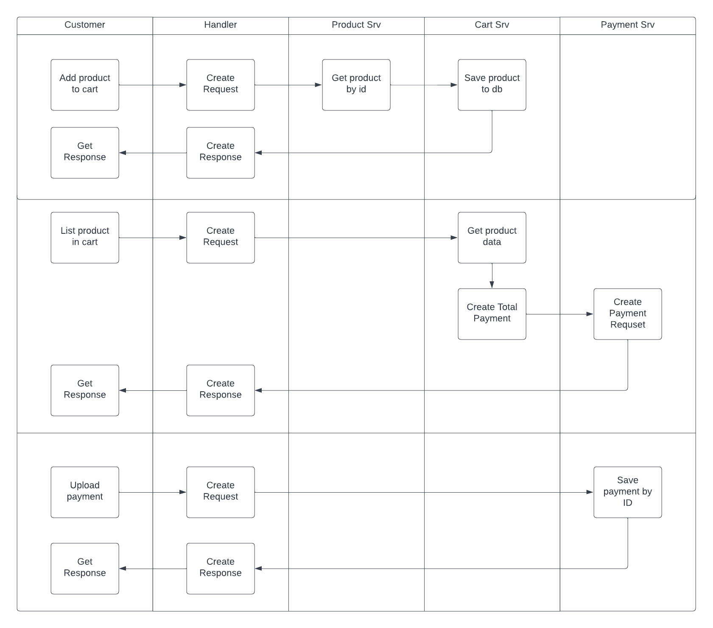
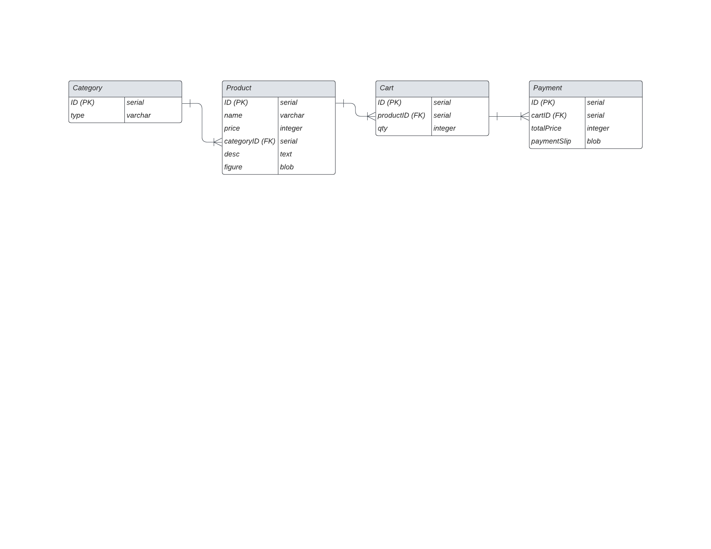

# How to Run
 1. Install Go 1.18 or higher
 2. Install Docker Desktop or Docker with docker-compose
 3. Install Postman or other RestAPI Client
 4. Run in your terminal <br/>
 `docker pull iqbalardyp/efisheryecommerce`
 5. You should be able to test the API<br/><br/>

# [RFC] - eCommerce App
## Related Document

| Document Name  | Document URL |
| --- | --- |
|  |  |

## Table of Content
Version:
<br/>
1. [Summary](#Summary)
2. [Problem and Motivation](#Problem_and_Motivation)
3. [Detailed Design](#Detailed_Design)
4. [Dependencies](#Dependencies)
5. [Milestones/Deployment Strategy](#Milestones/Deployment_Strategy)
6. [Data Result](#Data_Result)
7. [Drawbacks/Risks/Possible Failures](#Drawbacks/Risks/Possible_Failures)
8. [Alternatives](#Alternatives)
9. [Unresolved/Future Possibilities](#Unresolved/Future_Possibilities)

<br/>

***Need Review***
| @Mention Person | Status or Description |
| --- | --- |
|  |  |
<br/>

**Version**
| Date Updated | Changes Summary |
| --- | --- |
| 8 Nov 2022 | V 1.0 |
<br/>

## Summary
The current commercial process are performed manually i.e. product collection and product listing to payment. Customer are also have a degree of difficulty to pick the desired product from our service. In order to improve efficiency and easy access of our service, we need to automate our commercial process in the form of eCommerce App. 

## Problem and Motivation
The current commercial process are performed manually i.e. product collection and product listing to payment. Customer are also have a degree of difficulty to pick the desired product from our service. In order to improve efficiency and easy access of our service, we need to automate our commercial process in the form of eCommerce App. 

## Detailed Design

### Flowchart

### Swimlane Diagram


### API Contract
**General**
- Success Response Format

```
{
    code: integer,
    msg: string,
    data: interface{}
}

# Example
{
    code: 200,
    msg: "successfully get user",
    data: {
        id: 1,
        ...
    },
    ...
}
```

- Error Response Format
```
{
    code: integer,
    msg: string,
    data: interface{}
}

# Example
{
    code: 404,
    msg: "invalid req body",
    data: nil
}
```
**Specific**<br/>
[API Documentation](https://documenter.getpostman.com/view/24179858/2s8YeoNt3A)
## Dependencies
## Milestones/Deployment Strategy
## Data Result
### ERD

## Drawbacks/Risks/Possible Failures
## Alternatives
## Unresolved/Future Possibilities
- update payment srv to fulfill erd design
- Add user and user authorization
- Add unit test
- Deploy to opensource hosting service
